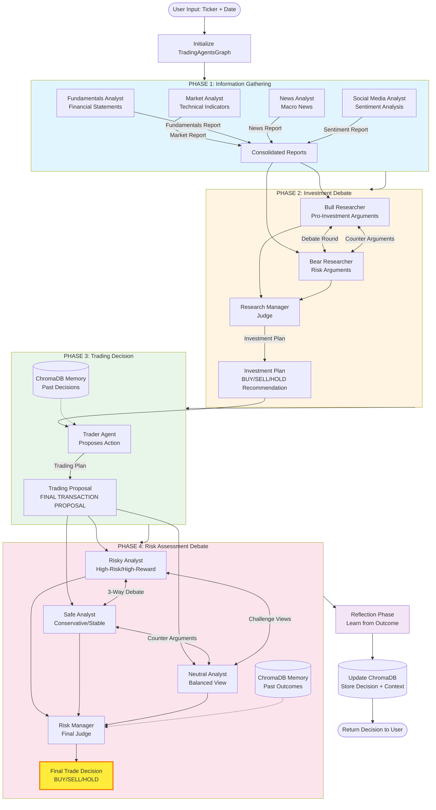
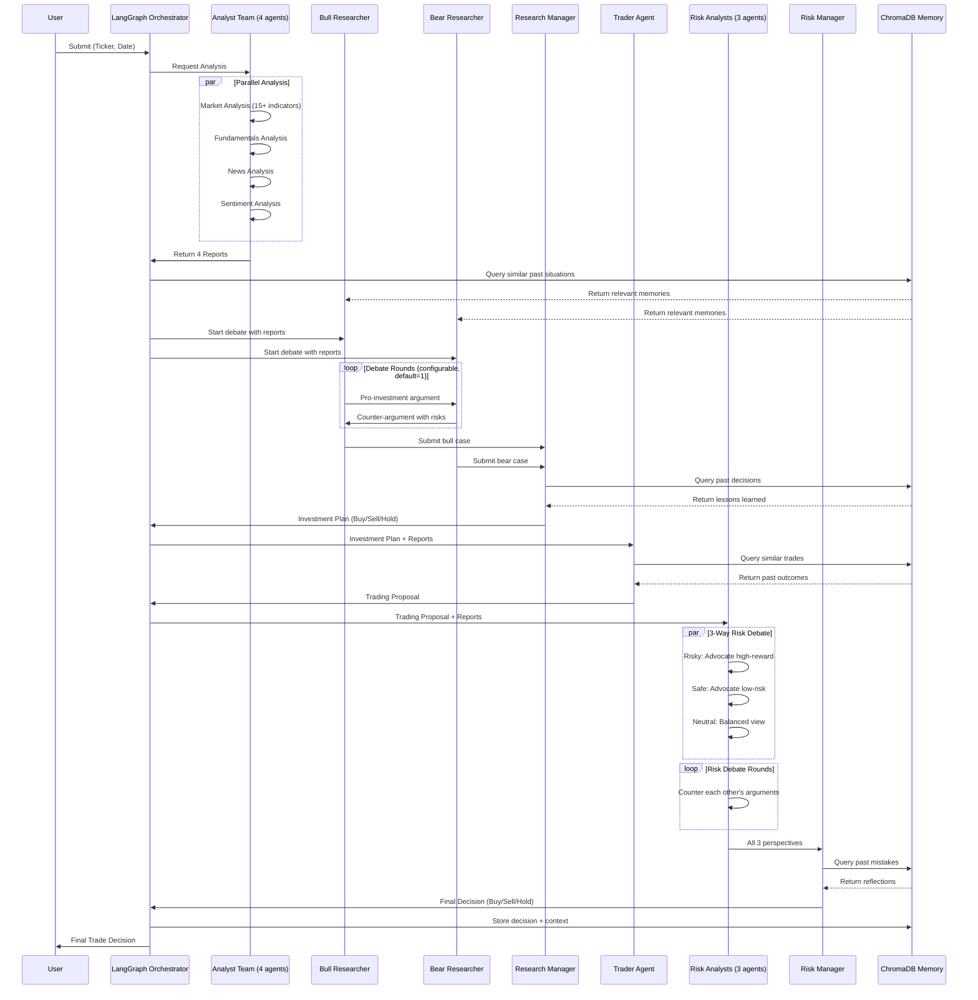
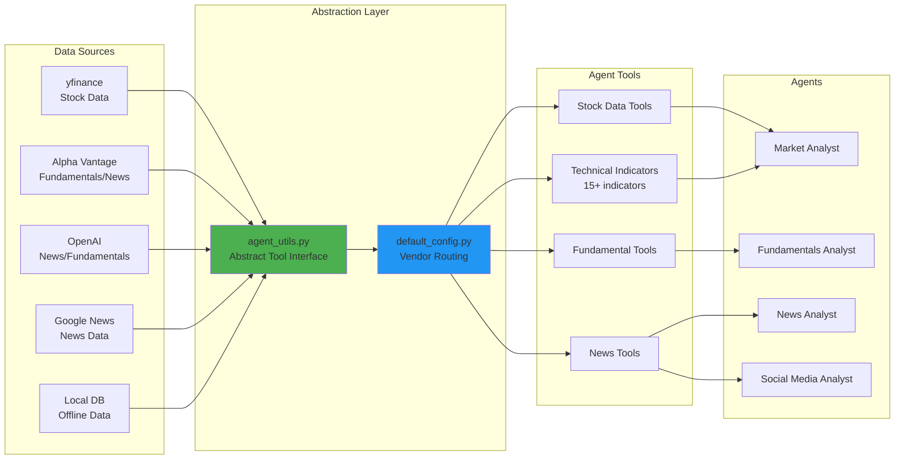
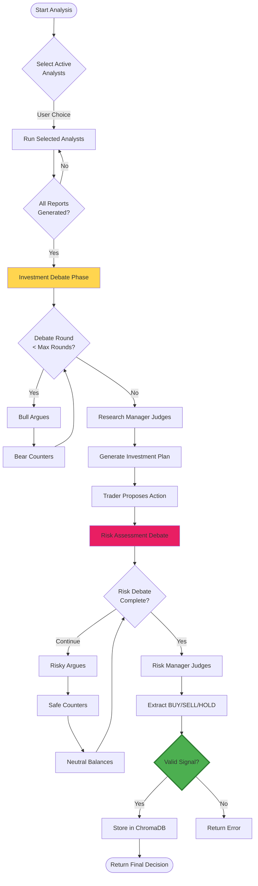

# TradingAgents Workflow Diagram

## System Architecture Overview



## Detailed Agent Flow



## Data Flow Architecture



## Memory System Architecture

```mermaid
graph TB
    subgraph "ChromaDB Collections"
        BullMem[Bull Researcher<br/>Memory Collection]
        BearMem[Bear Researcher<br/>Memory Collection]
        TraderMem[Trader<br/>Memory Collection]
        RMMem[Research Manager<br/>Memory Collection]
        RiskMgrMem[Risk Manager<br/>Memory Collection]
    end

    subgraph "Embedding Models"
        OpenAIEmb[OpenAI<br/>text-embedding-ada-002]
        OllamaEmb[Ollama<br/>nomic-embed-text]
        GoogleEmb[Google<br/>Generative AI]
    end

    subgraph "Memory Operations"
        Store[Store Decision<br/>+ Context + Outcome]
        Query[Query Similar<br/>Situations (n=2)]
        Learn[Learn from<br/>Past Mistakes]
    end

    OpenAIEmb --> BullMem
    OllamaEmb --> BearMem
    GoogleEmb --> TraderMem

    Store --> BullMem
    Store --> BearMem
    Store --> TraderMem
    Store --> RMMem
    Store --> RiskMgrMem

    BullMem --> Query
    BearMem --> Query
    TraderMem --> Query
    RMMem --> Query
    RiskMgrMem --> Query

    Query --> Learn

    style Store fill:#FF9800
    style Query fill:#03A9F4
    style Learn fill:#9C27B0
```

## Decision Flow with Conditional Logic



## Key Features

### Multi-Agent Collaboration
- **8-11 specialized agents** working in phases
- **LangGraph orchestration** manages state transitions
- **Structured debates** with adversarial collaboration

### Memory & Learning
- **ChromaDB** stores past decisions and outcomes
- **Semantic similarity search** retrieves relevant past experiences
- **Reflection mechanism** updates memory after each decision

### Flexible Configuration
- **38+ config options** in `default_config.py`
- **Multiple LLM providers**: OpenAI, Anthropic, Google, Ollama, LMStudio
- **Multiple data vendors**: yfinance, Alpha Vantage, OpenAI, Google, Local

### Technical Analysis
- **15+ technical indicators**: MACD, RSI, Bollinger Bands, Moving Averages, ATR, etc.
- **Fundamental analysis**: P/E ratio, debt, cash flow, income statements
- **Sentiment analysis**: Social media, news sentiment
- **Macro analysis**: Global news, economic indicators

---

*Generated for TradingAgents - Multi-Agent LLM Financial Trading Framework*
